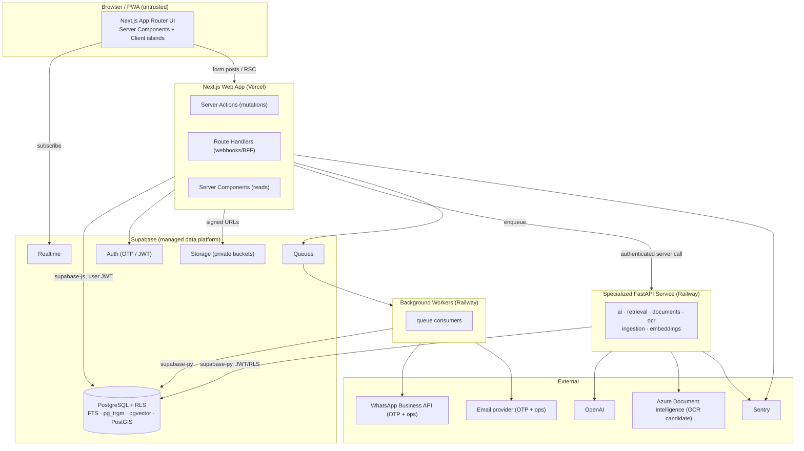

# 01 — System Overview

Complete system architecture for the Aladdin MVP. Complements (does not replace) [`ARCHITECTURE_GUIDE.md`](../architecture/ARCHITECTURE_GUIDE.md) and the ADRs; here it is expressed as an implementation blueprint.

## 1. Architecture at a glance

Aladdin is a **modular monolith** (ADR-0001) of four cooperating parts. It is B2B-first, consultation-first, bilingual (AR-RTL / EN-LTR), and multi-tenant with the **organization as the tenant** and **Row Level Security as the isolation spine**.

### The four parts and their responsibilities

| Part | Runtime | Owns | Never does |
|---|---|---|---|
| **Web app** | Next.js App Router (Vercel) | All product CRUD & user flows; i18n/RTL; theming; PWA; the primary path to Supabase via `supabase-js` preserving the user JWT | Hold service-role secrets in client code; embed heavy AI/OCR inline |
| **Data platform** | Supabase | System of record (Postgres), Auth, Storage, RLS, Realtime, Queues, search/vector/geo extensions | — (owns schema via migrations only) |
| **Specialized service** | FastAPI (Railway) | AI orchestration, OCR, document processing, chunking, embeddings, RAG, evaluations, NLP, large-Excel, workers | Recreate application CRUD |
| **Workers** | Railway (Docker) | Async/slow/external work off the request path | Run inside the web request loop |

## 2. Bounded contexts

Contexts map 1:1 to the **frontend feature modules** ([`module-boundaries.md`](../architecture/module-boundaries.md)). Each context owns its entities, workflows, and data; cross-context interaction goes through shared `server/` services or the database — never feature-to-feature imports.

| Context (module) | Responsibility | Core entities (see [02](02_domain_model.md)) |
|---|---|---|
| **auth** | Passwordless OTP registration/sign-in, session, JWT | User, OtpChallenge (transient), Session |
| **accounts** | Canonical identity, profile, primary account type, contacts | User, Profile, Contact, AccountType |
| **organizations** | Tenant orgs, branches, memberships, capabilities | Organization, Branch, Membership, Capability |
| **verification** | Identity/org/professional verification lifecycle & documents | Verification, VerificationDocument |
| **catalog** | Products, brands, categories, media, publishing | Product, Brand, Category, ProductMedia |
| **inventory** | Stock/availability signalling per product/branch | Inventory, Availability |
| **sales** | The B2B operating workflow (the wedge, 05C): Opportunity → Need → Match → Smart Share → Follow-up → Pipeline → Task | Opportunity, Need, Match, PipelineStage, Task, FollowUp |
| **rfq** | Requests for quote from needs/discovery | RfqRequest, RfqItem |
| **quotations** | Quotes, quote items, comparison, decisions | Quote, QuoteItem, QuoteDecision |
| **projects** | Execution/tracking of accepted work | Project, ProjectActivity |
| **notifications** | Delivery + notification center + preferences | Notification, NotificationPreference |
| **advertisements** | Promoted placements (MVP capability area) | Advertisement, AdPlacement |
| **analytics** | Aggregations/metrics for cockpits & admin | AnalyticsSnapshot (derived) |
| **admin** | Governance: verification review, moderation, platform ops | (acts across contexts) + AuditLog |
| **ai** | Consultation, intent extraction, match explanation, follow-up drafting, RAG, evaluations | (derived artifacts: Embedding, Extraction, Evaluation) |
| **conversations** (cross-cutting) | Threaded messaging tied to consultations/RFQ/projects | Conversation, Message |
| **subscriptions** (cross-cutting) | Plan/entitlement/state that gates access | Subscription, Plan (⚑ tiers OPEN) |
| **documents/media** (cross-cutting) | Files, OCR-derived text, media assets | Document, Media |

> **Backend capability modules** (`ai · retrieval · documents · ocr · ingestion · embeddings · workers`) are **not** business contexts — they are technical capabilities invoked by contexts (mainly `ai`, `verification`, `catalog`, `analytics`).

## 3. Data ownership

- **Schema** is owned exclusively by `supabase/migrations/*.sql` (ADR-0002). No web or Python module creates/alters schema.
- **Row ownership** is expressed by tenancy columns: `organization_id` (tenant-owned) and `branch_id` (branch-scoped) per [naming conventions](../database/naming-conventions.md). Personal (non-org) data is owned by `user_id`.
- **Write ownership:** the web app owns user-facing CRUD; the FastAPI service owns **derived** artifacts (embeddings, OCR extractions, evaluations) and writes them back through the same RLS-governed tables.
- **No second database.** One shared Postgres; no per-service private schema unless a future ADR adds one.

## 4. Internal communication

| From → To | Mechanism | Notes |
|---|---|---|
| Browser → Web | Server Actions (mutations), RSC (reads), Route Handlers (webhooks) | Browser is untrusted; only `NEXT_PUBLIC_*` validated config reaches it |
| Web → Postgres | `supabase-js` with the **user JWT** | RLS enforces tenant isolation |
| Web → FastAPI | Authenticated server-side HTTPS call (never from browser) | FastAPI verifies the Supabase JWT and derives identity from it |
| Web/FastAPI → Workers | **Supabase Queues** (enqueue) | Heavy/slow/external work only; handlers are idempotent |
| Any writer → Browser | **Supabase Realtime** channels | Live status; no client polling |
| FastAPI/Workers → Postgres | `supabase-py`, preserving JWT/RLS; `service_role` only for trusted, explicitly-authorized worker ops | Complex ops via PostgreSQL functions/RPC |

**Realtime channels (MVP):** notifications, opportunity/pipeline status, task updates, verification status, project activity, inventory availability, quotation status ([realtime-and-background-jobs.md](../architecture/realtime-and-background-jobs.md)). Channel/event schemas are defined in [10_events.md](10_events.md).

## 5. External integrations (approved stack only)

Per ADR-0001/0004 and [`security-model.md`](../security/security-model.md). All third-party credentials are server-side only.

| Integration | Use in MVP | Status |
|---|---|---|
| **Supabase** | Postgres, Auth (OTP/JWT), Storage, Realtime, Queues | Approved (core) |
| **OpenAI** | LLM + embeddings for AI consultation/RAG/evaluations | Approved |
| **Azure Document Intelligence** | OCR for verification/documents | **Candidate** (not finalized) |
| **WhatsApp Business API** | Phone OTP + operational message delivery (no SMS) | Approved (auth + ops) |
| **Email provider** | Email OTP/verification links + operational email | Approved (provider ⚑ OPEN) |
| **Sentry** | Error monitoring (web + service) | Approved |
| Excel (import/export), PDF (generation) | In-app/worker capabilities, not external SaaS | Approved (libraries, justified per dependency policy) |

**Not in the approved stack (do not build in MVP without a new ADR):** Cloudinary (→ Supabase Storage is the media store), Firebase/mobile push (→ Realtime + email + WhatsApp are the MVP channels), Google Maps/Places (→ internal Egyptian locality data + PostGIS). See [13_integrations.md](13_integrations.md) §"Explicitly not approved" and [14_future_extensions.md](14_future_extensions.md).

## 6. Cross-cutting concerns

- **Config:** one validated module per service (`frontend/src/lib/env`, `backend/app/config.py`); fail-fast; no `process.env`/`os.getenv`/`load_dotenv` in app code.
- **i18n/RTL:** `next-intl`; logical CSS properties; every surface works identically in AR-RTL and EN-LTR.
- **Theming:** Light + Dark via the design-system semantic tokens (`.dark` class); see [`DESIGN.md`](../../DESIGN.md).
- **Observability:** `structlog` (FastAPI), Sentry (both), health endpoints (`/api/health`, `/health`).
- **AI safety:** AI **drafts, explains, ranks**; humans decide and send. Retrieval applies authorization filters **before** returning content — no cross-org leakage.

## 7. Environments

**Local → Staging → Production** (ADR-0004). Migrations are backward-compatible (expand → backfill → contract). No real Production services are connected during specification/foundation work.

## 8. Non-goals (MVP)

Payments/escrow/milestones/disputes; add-to-cart/checkout commerce; price-war reverse-auction; a generic horizontal CRM; native mobile apps; service extraction; Kubernetes/Kafka/Redis/Elasticsearch/etc. (ADR-0001 exclusions). See [14_future_extensions.md](14_future_extensions.md).
