# 04 — Relationships (ERD)

| | |
|---|---|
| **Status** | Specification · Phase 0.7 (pre-implementation) |
| **Version** | 1.0.0 |
| **Owner** | Architecture / Foundation |
| **Last Updated** | 2026-08-01 |
| **Depends On** | 02_domain_model.md, 03_database_design.md |
| **Related** | 06_rls_strategy.md |

Cardinality, cascade, delete, and ownership rules for the [domain model](02_domain_model.md) / [schema](03_database_design.md).

## 1. ERD — core clusters

```mermaid
erDiagram
  USERS ||--|| PROFILES : has
  USERS ||--o{ CONTACTS : has
  USERS ||--o{ MEMBERSHIPS : holds
  ORGANIZATIONS ||--o{ MEMBERSHIPS : includes
  ORGANIZATIONS ||--o{ BRANCHES : has
  BRANCHES ||--o{ MEMBERSHIPS : assigns
  MEMBERSHIPS ||--o{ MEMBERSHIP_CAPABILITIES : grants
  USERS ||--o{ PLATFORM_ROLE_GRANTS : may_have

  ORGANIZATIONS ||--o{ PRODUCTS : owns
  BRANDS ||--o{ PRODUCTS : groups
  CATEGORIES ||--o{ PRODUCTS : classifies
  CATEGORIES ||--o{ CATEGORIES : parent_of
  PRODUCTS ||--o{ PRODUCT_MEDIA : has
  PRODUCTS ||--o{ INVENTORY : stocked_as
  PRODUCTS ||--o{ AVAILABILITY : signalled_by

  USERS ||--o{ VERIFICATIONS : subject
  ORGANIZATIONS ||--o{ VERIFICATIONS : subject
  VERIFICATIONS ||--o{ VERIFICATION_DOCUMENTS : evidenced_by
  VERIFICATION_DOCUMENTS }o--|| DOCUMENTS : references

  ORGANIZATIONS ||--o{ OPPORTUNITIES : runs
  MEMBERSHIPS ||--o{ OPPORTUNITIES : owns
  NEEDS ||--o{ OPPORTUNITIES : originates
  OPPORTUNITIES ||--o{ TASKS : has
  OPPORTUNITIES ||--o{ FOLLOW_UPS : has
  NEEDS ||--o{ MATCHES : yields
  PRODUCTS ||--o{ MATCHES : matched_in

  RFQ_REQUESTS ||--o{ RFQ_ITEMS : contains
  RFQ_REQUESTS ||--o{ QUOTES : receives
  QUOTES ||--o{ QUOTE_ITEMS : contains
  QUOTES ||--|| QUOTE_DECISIONS : decided_by
  ORGANIZATIONS ||--o{ QUOTES : responds_with

  QUOTES ||--o{ PROJECTS : may_start
  ORGANIZATIONS ||--o{ PROJECTS : executes
  PROJECTS ||--o{ PROJECT_ACTIVITIES : logs
  PROJECTS ||--o{ TASKS : has

  CONVERSATIONS ||--o{ MESSAGES : contains
  CONVERSATIONS ||--o{ CONVERSATION_PARTICIPANTS : includes
  MESSAGES ||--o{ MESSAGE_ATTACHMENTS : has

  USERS ||--o{ NOTIFICATIONS : receives
  USERS ||--|| NOTIFICATION_PREFERENCES : configures

  ORGANIZATIONS ||--o{ ADVERTISEMENTS : places
  ADVERTISEMENTS ||--o{ AD_PLACEMENTS : shows_at
  PLANS ||--o{ SUBSCRIPTIONS : defines
  ORGANIZATIONS ||--o{ SUBSCRIPTIONS : subscribes

  LOCALITIES ||--o{ PROFILES : locates
  LOCALITIES ||--o{ ORGANIZATIONS : locates
  MEDIA ||--o{ PRODUCT_MEDIA : used_in
```

## 2. Relationship catalog (cardinality + delete rule)

**Delete-rule legend:** `RESTRICT` = block delete while children exist; `CASCADE` = delete children with parent; `SET NULL` = null the FK; `SOFT` = parent soft-deleted, children follow via app logic; `NO DELETE` = immutable (audit/trust). Tenancy delete follows the org lifecycle (archive, not hard delete) in MVP.

| Parent → Child | Card. | FK on child | On delete | Ownership |
|---|---|---|---|---|
| users → profiles | 1–1 | user_id | CASCADE | USER |
| users → contacts | 1–* | user_id | CASCADE | USER |
| users → memberships | 1–* | user_id | RESTRICT (revoke instead) | ORG |
| organizations → memberships | 1–* | organization_id | RESTRICT | ORG |
| organizations → branches | 1–* | organization_id | RESTRICT | ORG+BRANCH |
| branches → memberships | 0..1–* | branch_id | SET NULL | ORG+BRANCH |
| memberships → membership_capabilities | 1–* | membership_id | CASCADE | ORG |
| users → platform_role_grants | 1–* | user_id | CASCADE | PLATFORM |
| organizations → products | 1–* | organization_id | SOFT (archive) | ORG |
| brands → products | 0..1–* | brand_id | SET NULL | ORG/PLATFORM |
| categories → products | 0..1–* | category_id | SET NULL | PLATFORM |
| categories → categories | tree | parent_id | RESTRICT | PLATFORM |
| products → product_media | 1–* | product_id | CASCADE | ORG |
| products → inventory | 1–* | product_id | CASCADE | ORG+BRANCH |
| products → availability | 1–* | product_id | CASCADE | ORG+BRANCH |
| users/orgs → verifications | 1–* | user_id/organization_id | NO DELETE | subject |
| verifications → verification_documents | 1–* | verification_id | RESTRICT | subject |
| documents ← verification_documents | *–1 | document_id | RESTRICT | subject |
| organizations → opportunities | 1–* | organization_id | SOFT | ORG+BRANCH |
| memberships → opportunities | 1–* | owner_membership_id | RESTRICT (reassign) | ORG |
| needs → opportunities | 0..1–* | need_id | SET NULL | context |
| opportunities → tasks | 1–* | opportunity_id | CASCADE | ORG+BRANCH |
| opportunities → follow_ups | 1–* | opportunity_id | CASCADE | ORG |
| needs → matches | 1–* | need_id | CASCADE | context |
| products → matches | 0..1–* | product_id | SET NULL | context |
| rfq_requests → rfq_items | 1–* | rfq_request_id | CASCADE | requester |
| rfq_requests → quotes | 1–* | rfq_request_id | RESTRICT | responder ORG |
| quotes → quote_items | 1–* | quote_id | CASCADE | responder ORG |
| quotes → quote_decisions | 1–1 | quote_id | NO DELETE | requester |
| organizations → quotes | 1–* | responder_org_id | RESTRICT | responder ORG |
| quotes → projects | 0..1–* | source_quote_id | SET NULL | ORG |
| organizations → projects | 1–* | organization_id | SOFT | ORG+BRANCH |
| projects → project_activities | 1–* | project_id | CASCADE | ORG |
| projects → tasks | 0..1–* | project_id | CASCADE | ORG+BRANCH |
| conversations → messages | 1–* | conversation_id | CASCADE | context |
| conversations → conversation_participants | 1–* | conversation_id | CASCADE | context |
| messages → message_attachments | 1–* | message_id | CASCADE | context |
| users → notifications | 1–* | recipient_user_id | CASCADE (archive first) | USER |
| users → notification_preferences | 1–1 | user_id | CASCADE | USER |
| organizations → advertisements | 1–* | organization_id | SOFT | ORG |
| advertisements → ad_placements | 1–* | advertisement_id | CASCADE | ORG/PLATFORM |
| plans → subscriptions | 1–* | plan_id | RESTRICT | ORG/USER |
| organizations/users → subscriptions | 1–* | organization_id/user_id | RESTRICT | ORG/USER |
| localities → localities | tree | parent_id | RESTRICT | PLATFORM |
| media → product_media / profiles / ads | *–1 | media_id | RESTRICT | context |

## 3. Many-to-many relationships

| Relationship | Junction table | Notes |
|---|---|---|
| Users ↔ Organizations | `memberships` | with status + branch + capabilities |
| Memberships ↔ Capabilities | `membership_capabilities` | capability keys from fixed catalog |
| Users ↔ Conversations | `conversation_participants` | participant access → RLS |
| RFQ ↔ Providers (orgs) | `quotes` | each provider's response is one quote |
| Messages ↔ Files | `message_attachments` | media/documents |

## 4. One-to-one relationships

| Pair | Enforced by |
|---|---|
| User ↔ Profile | `uq_profiles_user_id` |
| User ↔ NotificationPreference | `uq` on user_id |
| Quote ↔ QuoteDecision | `uq`/`1–1` on quote_id |
| Organization ↔ current Subscription | one `active`/`trialing` per org (partial unique) |
| Contact ↔ primary | partial unique `is_primary` per user |

## 5. Ownership & tenancy rules

- **Tenant boundary = organization.** Every tenant-owned table carries `organization_id`; branch-scoped rows also carry `branch_id`. RLS filters on the caller's org/branch/capabilities ([06](06_rls_strategy.md)).
- **Personal data** (users, profiles, contacts, personal needs, notifications, preferences) is owned by `user_id`.
- **Polymorphic ownership** (documents, media, conversations) resolves tenancy through `organization_id`/`user_id` columns carried on the row itself (never inferred only from the parent) so RLS can evaluate without joins.
- **Reference/platform data** (categories, brands, localities, plans, account types) is globally readable, admin-writable.
- **Cross-entity integrity:** CHECK constraints enforce "exactly one of" for polymorphic subject/requester columns (verifications, rfq_requests, subscriptions, tasks).

## 6. Cascade philosophy

1. **Trust/audit data is never cascade-deleted** (`verifications`, `quotes`, `quote_decisions`, `audit_log`). Parent organizations are **archived**, not hard-deleted, so this history survives.
2. **Composition children cascade** (items, media, participants, activities) because they have no meaning without their parent.
3. **Associations use SET NULL** (brand/category on product, need on opportunity) so reference re-org doesn't destroy operational rows.
4. **Memberships are revoked, not deleted**, to preserve attribution on the work they produced.
5. Hard deletion happens only via a **retention purge job** on soft-deleted rows past their window ([09](09_background_jobs.md), ⚑ windows OPEN), never via user action.
