# 11 — State Machines

| | |
|---|---|
| **Status** | Specification · Phase 0.7 (pre-implementation) |
| **Version** | 1.0.0 |
| **Owner** | Architecture / Foundation |
| **Last Updated** | 2026-08-01 |
| **Depends On** | 02_domain_model.md, 03_database_design.md, 10_events.md |
| **Related** | 12_validation_rules.md |

Every stateful workflow in the MVP: states, transitions, guards (validation), failure cases, and recovery. Enum values are in [03](03_database_design.md); transitions emit events ([10](10_events.md)). **Specification only.**

**Rules for all machines:** transitions are validated server-side (never trust the client's requested target); illegal transitions return `CONFLICT (409)`; every transition is atomic with its event/outbox row; security-relevant transitions write `audit_log`.

## 1. Organization

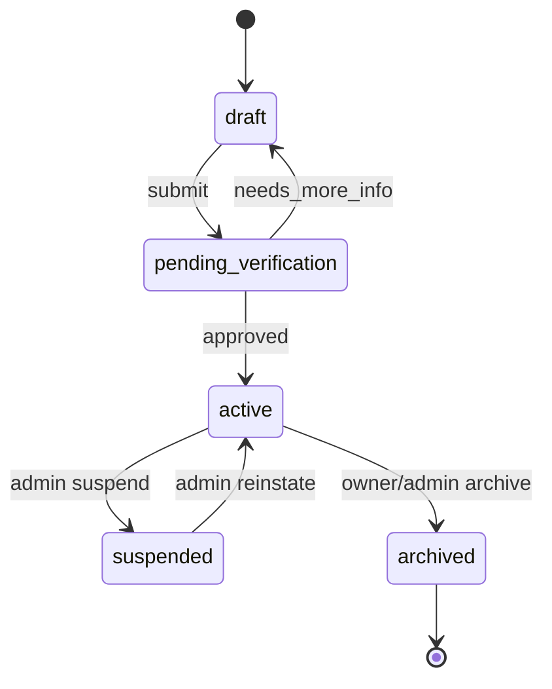
| Transition | Guard | Failure / Recovery |
|---|---|---|
| draft→pending_verification | required org fields + ≥1 verification doc | missing fields → 422; resubmit |
| pending_verification→active | platform verification approved | — |
| pending_verification→draft | reviewer `needs_more_info` | owner adds info, resubmits |
| active→suspended | admin only, reason | audited; capabilities frozen (read-only) |
| active→archived | no active obligations (⚑ block if open RFQ/quotes?) | children preserved (trust/audit) |

## 2. Verification (user or organization subject)

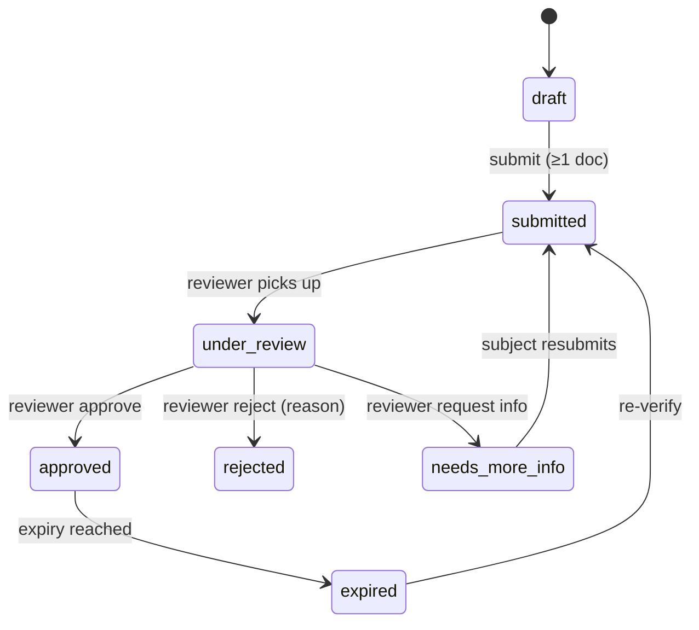
| Guard | Detail |
|---|---|
| submit | ≥1 valid document; subject has `verification.submit` |
| decide | platform reviewer; **not the subject** (no self-approval); reason required on reject/needs_more_info |
| approve side effects | `is_verified=true`; unlock verification-gated capabilities (publish/RFQ-respond) |
**Failure/recovery:** OCR failure on a doc does not block manual review; a rejected verification can be restarted; expiry triggers a re-verify prompt.

## 3. Product

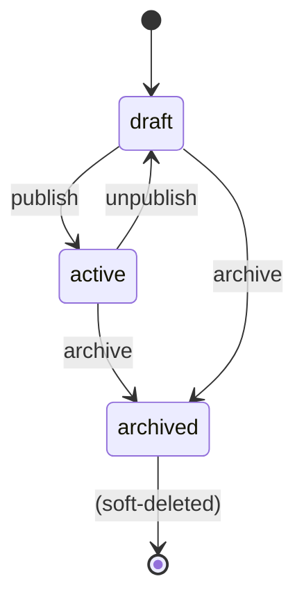
| Transition | Guard |
|---|---|
| draft→active (publish) | required fields + ≥1 media + **org verified** (⚑ confirm gate); `catalog.publish` |
| active→archived | `catalog.write`; de-index from discovery |
**Failure/recovery:** publish blocked → field-level 422; embedding job failure retries ([09](09_background_jobs.md)) and doesn't block publish.

## 4. Opportunity (sales pipeline)

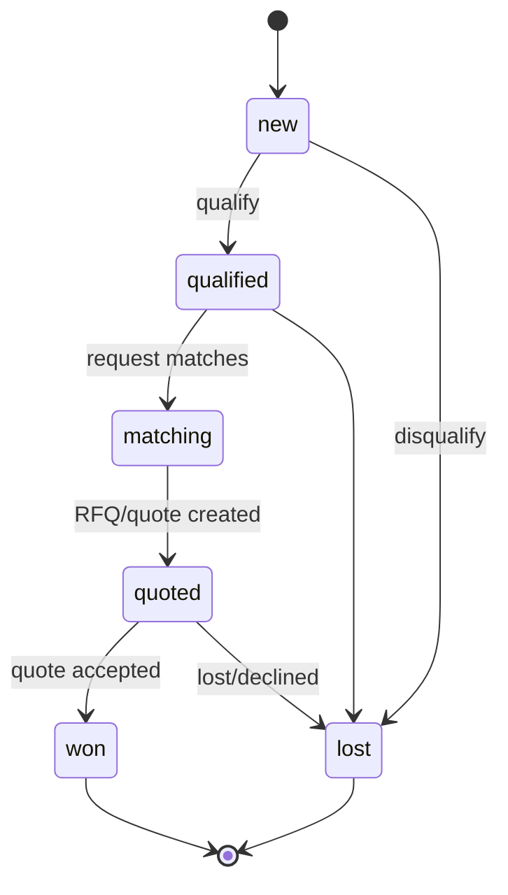
- Stage changes stream on `pipeline:{orgId}`; `won`/`lost` are audited and feed analytics (win-rate). Backward moves allowed except out of terminal `won`/`lost` (reopen = new opportunity). ⚑ Whether stages are org-customizable: default fixed.

## 5. RFQ

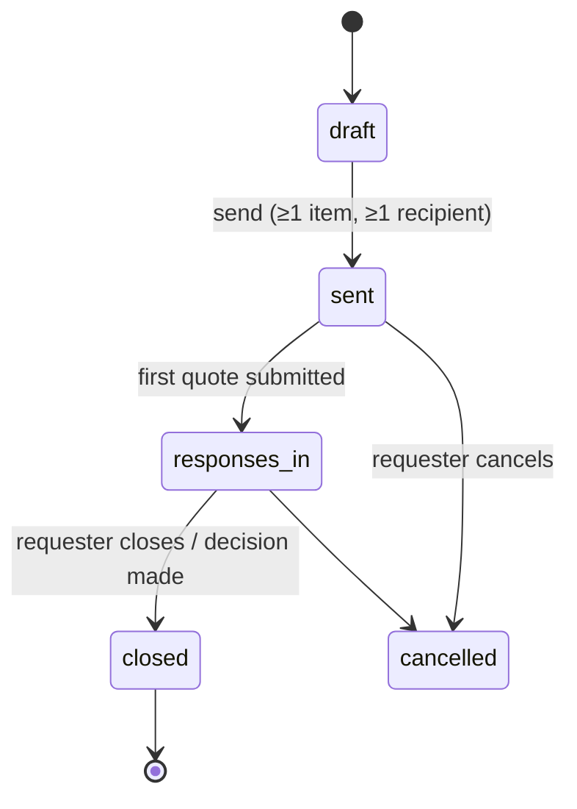
- Anti-auction: responders never see each other. Closing on an accepted decision transitions linked opportunity→`quoted`/`won`.

## 6. Quote

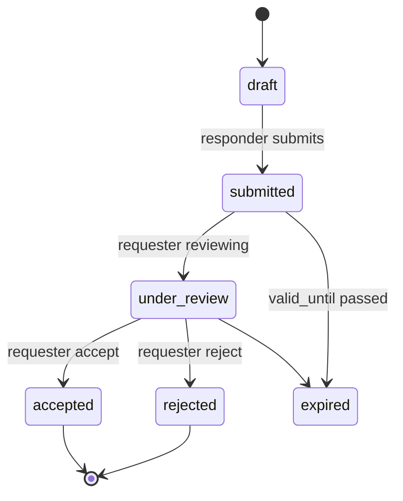
| Guard | Detail |
|---|---|
| submit | `quote.submit`; ≥1 item; `valid_until` future; org is RFQ recipient |
| decide | requester `quote.decide`; one decision per quote |
| accept side effects | emits `QuoteAccepted` → `pdf.generate`, may create Project |
**Failure/recovery:** expiry auto-transition via scheduled check; a rejected quote is terminal (responder submits a new one only if RFQ still open).

## 7. Project

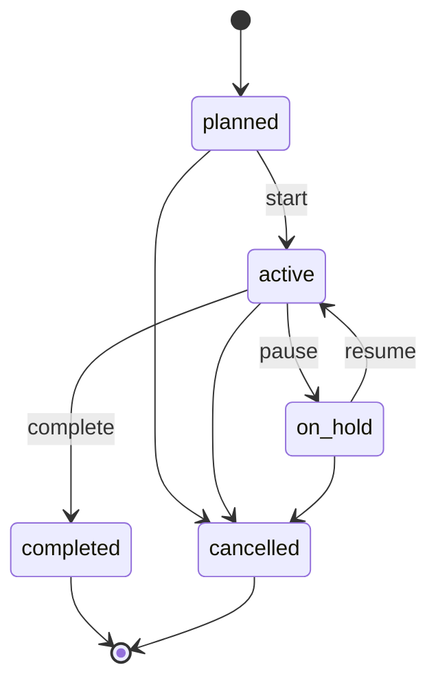
- MVP = tracking/follow-up only (no milestones/escrow). Activities append to the timeline; status streams on `project:{id}`.

## 8. Membership

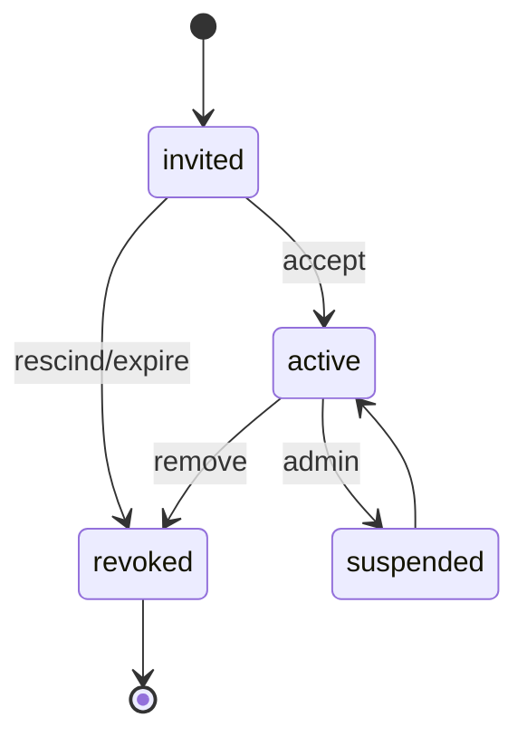
- Revoked (not deleted) to preserve attribution. Capability changes are audited.

> **Implementation status (Sprint 2.1 hardened, 2026-08-03):** the **Verification** (§2) and **Membership** (§8) machines are mandatory `security definer` RPC boundaries (migrations `2026080309000x` + `20260804090001`); browser and service roles have no direct DML bypass. Verification decisions serialize on the row, preserve the assigned reviewer, and become immutable; apply is expiry/subject/type checked and idempotent. Membership transitions serialize on the stable organization row for concurrency-safe last-owner protection. Illegal transitions raise `22023`; real transitions emit an in-transaction `audit_log` event.

## 8a. Account upgrade & public-profile eligibility (foundation note)

Not a per-row lifecycle enum yet, but a server-controlled transition recorded for Phase 1:

- **Account type:** `primary_account_type` transitions (e.g. `end_consumer → engineer`) happen **only** through the implemented approved-verification `apply_account_upgrade` RPC. It is transactional, auditable, caller-authorized from `platform_role_grants`, and extends the one identity. Direct browser and `service_role` table UPDATE are both denied.
- **Public-profile visibility:** `profiles.public_profile_status`: `hidden → listed` is set by the approved professional-verification/upgrade workflow (server-controlled); `listed → hidden` on suspension/withdrawal. Public discovery requires `listed` + professional account type + active user + not soft-deleted. See [ADR-0007 D10/D11](../decisions/ADR-0007-identity-and-tenancy-model.md).

## 9. Subscription

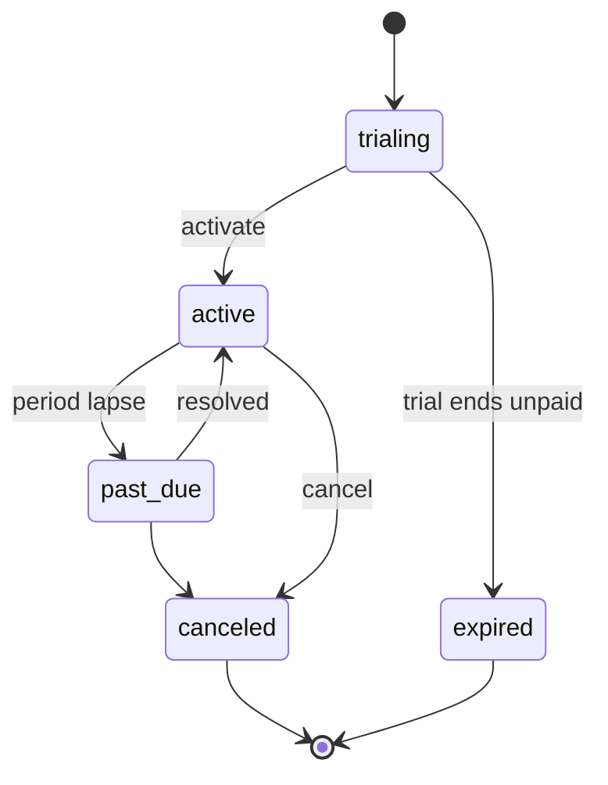
- **No billing in MVP** — transitions are administratively set. Entitlements/limits apply while `trialing`/`active`; `past_due`/`expired`/`canceled` degrade to a read-only/limited tier (⚑ exact degradation OPEN). State changes gate capabilities.

## 10. Conversation

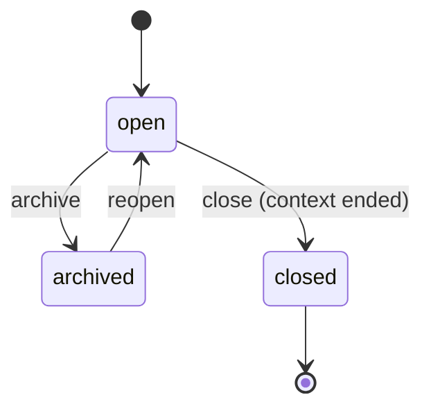
- Participants fixed by context; messages only while `open`.

## 11. Notification

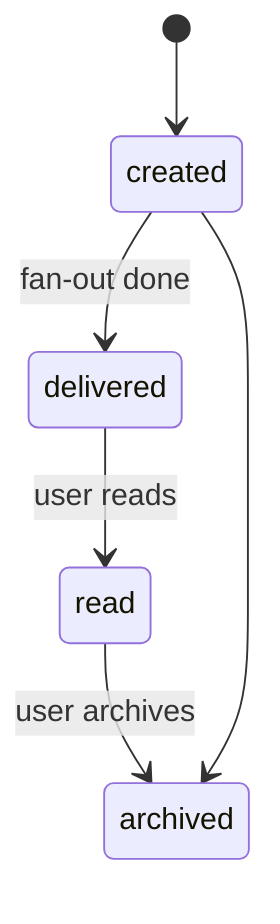
- Delivery per channel is tracked by the `notification.deliver` job; failure to deliver on one channel doesn't block others; `read` is user-driven.

## 12. Advertisement

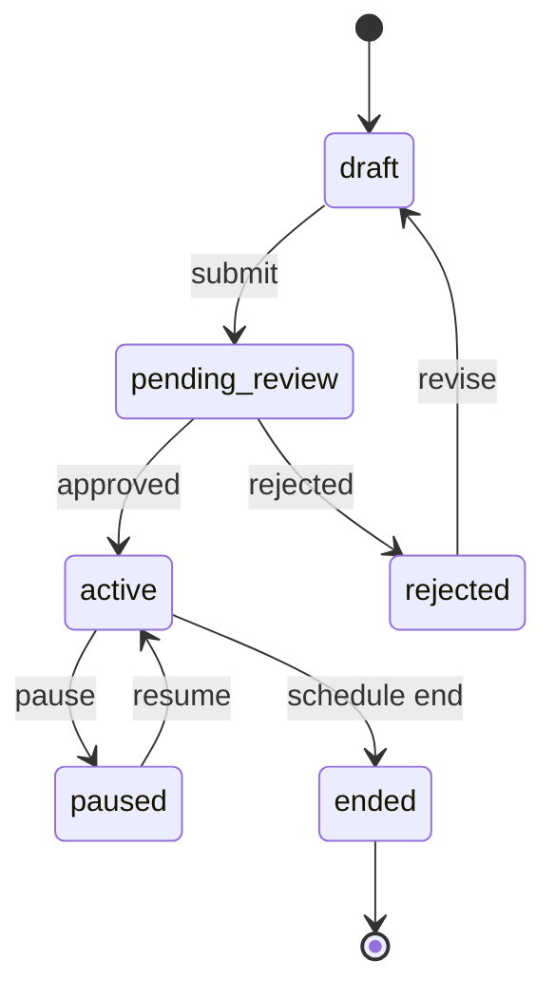
- Only `active` ads are publicly visible; creatives in `ad-creatives/` become public only on approval ([05](05_storage_design.md)).

## 13. Task & Follow-up (compact)

- **Task:** `open → in_progress → done | cancelled`. Assignee notified on create/update.
- **Follow-up:** `drafted → scheduled → sent | dismissed`. `sent` requires human approval (`sales.followup.send`) — **never auto-sent**; `followup.dispatch` job sends already-approved scheduled ones.

## 14. Cross-machine interactions

| When | Then |
|---|---|
| `VerificationDecided(approved)` on org | Organization `pending_verification → active`; product publish gate unlocked |
| `QuoteAccepted` | Quote→accepted; may create Project(`planned`); Opportunity→`won`; RFQ→`closed` |
| `SubscriptionStateChanged(past_due/expired)` | capability gates tighten across catalog/ads/AI |
| `OrganizationSuspended` | all org writes frozen; memberships read-only |

## 15. Recovery principles

- **Stuck transitions** (a job that should advance state failed): the scheduled reconciler re-checks and either retries the side effect or dead-letters ([09](09_background_jobs.md)); state never silently desyncs from side effects because the state change and its outbox row are atomic.
- **Illegal client request:** rejected with `409` and the current state; the UI refetches.
- **Expiry** (quote/verification/subscription/otp): handled by scheduled checks, not client clocks.
